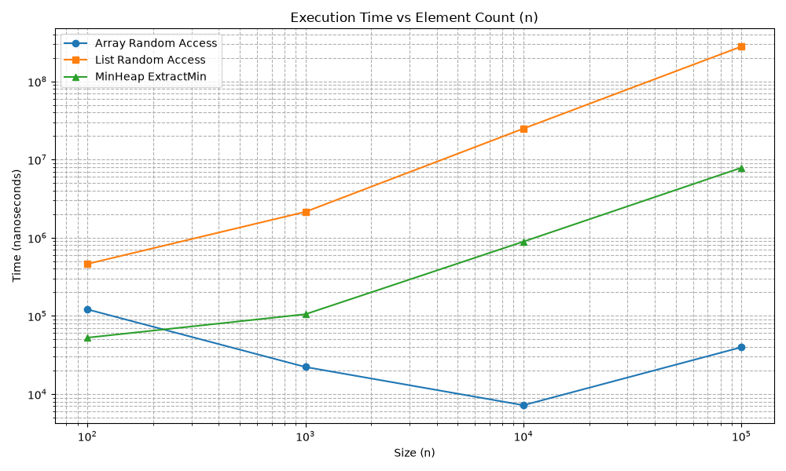
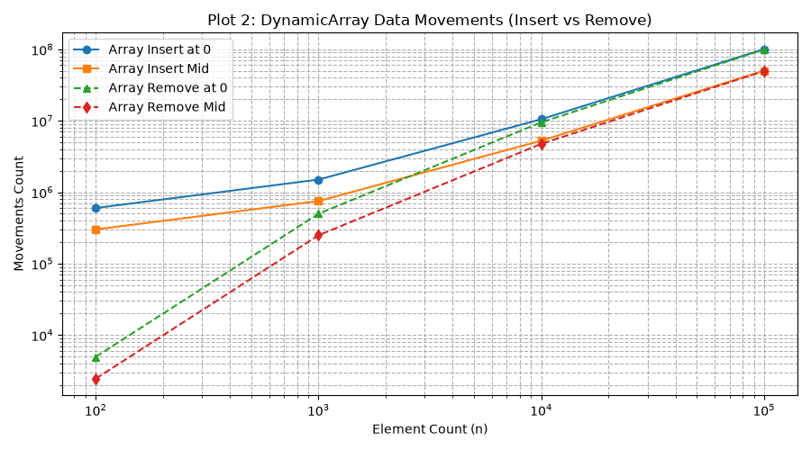
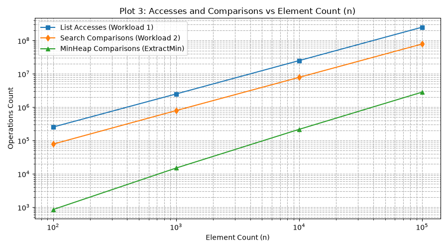

# Assignment 2: Basic Data Structures Performance Analysis

## 1. Overview
This project presents an empirical performance analysis and implementation of three fundamental data structures:
- **Dynamic Array**: Resizable array implementation featuring continuous memory layout.
- **Doubly Linked List**: Pointer-based linear data structure featuring references to both previous and next nodes, allowing efficient $O(1)$ insertions/removals at both ends (head and tail).
- **Min-Heap**: Binary heap representation backed by a dynamic array for priority queue operations.

The primary objective is to evaluate operational bounds, structural trade-offs, cache interaction, and metric counts (`accesses`, `movements`, `comparisons`) across defined workloads under identical benchmarking constraints.

---

## 2. Complexity Analysis
| Data Structure | Operation | Best Case ($\Omega$) | Average Case ($\Theta$) | Worst Case ($O$) |
|---|---|---|---|---|
| **Dynamic Array** | Access (by Index) | $\Omega(1)$ | $\Theta(1)$ | $O(1)$ |
| | Search (by Value) | $\Omega(1)$ | $\Theta(n)$ | $O(n)$ |
| | Insert / Remove (at 0) | $\Omega(n)$ | $\Theta(n)$ | $O(n)$ |
| | Insert / Remove (End) | $\Omega(1)$ | $\Theta(1)$ | $O(n)$ |
| **Doubly Linked List** | Access (by Index) | $\Omega(1)$ | $\Theta(n)$ | $O(n)$ |
| | Search (by Value) | $\Omega(1)$ | $\Theta(n)$ | $O(n)$ |
| | Insert / Remove (Head / Tail) | $\Omega(1)$ | $\Theta(1)$ | $O(1)$ |
| | Insert / Remove (Middle) | $\Omega(1)$ | $\Theta(n)$ | $O(n)$ |
| **Min-Heap** | Peek Min | $\Omega(1)$ | $\Theta(1)$ | $O(1)$ |
| | Insert | $\Omega(1)$ | $\Theta(\log n)$ | $O(\log n)$ |
| | Extract Min | $\Omega(\log n)$ | $\Theta(\log n)$ | $O(\log n)$ |

## 3. Correctness & Loop Invariants

### 3.1 Loop Invariant 1: Dynamic Array `remove(int index)`
- **Loop:** Shifting elements to the left after removing an element at `index`.
  ```java
  for(int i = idx; i < size-1; i++){
    arr[i] = arr[i+1];
  }
  ```
**Invariant:** At the start of iteration i (where index <= i <= size - 1), all elements in indices [0 ... i - 1] occupy their correct final positions post-removal, and for all k in [index ... i - 1], data[k] holds the value originally located at data[k + 1].

**Initialization:** Prior to the first iteration (i = index), the range [index ... i - 1] is empty. The invariant holds trivially as no shifts have occurred yet.

**Maintenance:** During iteration i, data[i] is assigned data[i + 1]. Incrementing i extends the property to index i, preserving the invariant for the range [index ... i].

**Termination:** The loop terminates when i == size - 1. By the invariant, every element from index index to size - 2 has been shifted one position to the left. The array size is then decremented, completing the shift correctly.
  
### 3.2 Loop Invariant 2: MinHeap siftDown(int i)
- **Loop:** Restoring heap property downwards from index i.
```java
while (hasLeftChild(i)) { ... }
```

**Invariant:** For every node k in the heap, if k is not an ancestor of i, the min-heap property holds at k (data[k] <= data[leftChild(k)] and data[k] <= data[rightChild(k)]). For ancestors of i, the subtree rooted at k maintains valid min-heap structures in both child branches, except potentially between node i and its immediate children.

**Initialization:** Before the loop, only node i may violate the min-heap property relative to its children after replacing the root with the last element.

**Maintenance:** In each step, if data[i] is greater than its smallest child, data[i] is swapped with that child at index smallest. The min-heap property is restored for index i, and the potential violation moves down to smallest. Setting i = smallest maintains the invariant for the next iteration.

**Termination:** The loop terminates when i has no children or data[i] <= data[smallestChild]. At this point, no violations remain, and the entire tree satisfies the min-heap property.

---

## 4. Experimental Setup
- **Workloads:**
  - **Workload 1 (Random Access):** $m = 10,000$ index access operations.
  - **Workload 2 (Search):** $m = 1,000$ linear search queries for random targets.
  - **Workload 3 (Insertion and Removal):** $m = 1,000$ insertions/removals at index 0 and index $n/2$.
  - **Workload 4 (Priority Processing):** Priority Queue operations (`insert` and `extractMin`).
- **Input Sizes ($n$):** $100, 1\,000, 10\,000, 100\,000$.
- **Environment:**
  - **JVM:** Java OpenJDK 17/21.
  - **Time Measurement:** `System.nanoTime()` measured across $5$ independent runs with averaged timing.
  - **Random Generator:** `java.util.Random` initialized with fixed seed `SEED = 42` for deterministic workloads.

---

## 5. Results

Full benchmark datasets are archived under [`results/tables/benchmark_results.md`](results/tables/benchmark_results.md).

### Visualizations
The performance plots generated from the benchmark metrics are stored under `results/plots/`:

1. **Plot 1: Execution Time Comparison**:
   

2. **Plot 2: Data Movements Comparison**:
   

3. **Plot 3: Accesses and Comparisons Comparison**:
   

---

## 6. Discussion & Performance Analysis

1. **Theory vs. Practice Comparison:**
   - **Workload 1 (Random Access):** `DynamicArray` execution time remains constant (O(1)), whereas `LinkedList` scales linearly with $n$ ($\sim O(n)$) due to index traversal via `getNode()`, matching theoretical expectations.
   - **Workload 2 (Search):** Both structures execute identical numbers of comparisons (O(n)), but `DynamicArray` evaluates substantially faster due to continuous memory layout and direct array indexing.

2. **Impact of CPU Cache Locality:**
   - In Workload 2, despite identical comparison counts, `DynamicArray` completes significantly faster than `LinkedList`.
   - Continuous memory layout enables CPU prefetching and cache line efficiency for arrays. In contrast, `LinkedList` node references reside in disjoint heap memory addresses, incurring frequent CPU cache misses.

3. **Movements Metric in Linked Lists:**
   - Across all insertion and deletion scenarios in Workload 3, `LinkedList` exhibits **$0$ movements**. Since linked lists adjust pointer references (`prev` and `next`) rather than shifting elements in memory, physical data movement is strictly zero.

4. **Insertion/Deletion at Head vs. Middle:**
   - `LinkedList` performs `Insert at 0` in O(1) time by setting head pointers, drastically outperforming `DynamicArray` which requires shifting all $n$ elements ($O(n)$).
   - For `Insert Mid`, `LinkedList` utilizes its $idx < size/2$ traversal optimization in `getNode()`, traversing from `head` or `tail` to n/2. However, `DynamicArray` still completes middle insertion faster because array index lookup is instant (O(1)) followed by array copy operations.

5. **Priority Queue Operations Efficiency:**
   - `MinHeap` performs insertions and extractions within logarithmic bounds $O(\log n)$. The height restriction bounds comparison and swap growth strictly according to theoretical models.

---

## 7. Design Recommendations

- **Use Dynamic Array when:**
  - Frequent random access by index is required (O(1)).
  - Memory overhead per element must be minimized.
  - Iterative scans/searches need maximum CPU cache performance.
  - Insertions/removals occur primarily at the end.

- **Use Doubly Linked List when:**
  - Frequent insertions or removals occur at both ends (head and tail) in O(1).
  - Array memory reallocations or element shifts are unacceptable.
  - Direct indexing by position is rarely or never performed.

- **Use Min-Heap when:**
  - Rapid retrieval of the minimum (or maximum) element is required.
  - Building scheduling systems, priority queues, or graph processing algorithms.

---

## 8. Conclusion
The experimental benchmarks validate theoretical asymptotic bounds across all data structures. While asymptotic analysis accurately models growth trends, physical CPU hardware mechanisms—specifically cache locality and pointer traversal overheads—heavily influence absolute execution timings. `DynamicArray` provides optimal general-purpose indexing and sequential iteration performance, `LinkedList` excels in head/tail pointer mutations with zero element movements, and `MinHeap` delivers efficient O(log n) priority retrieval.
